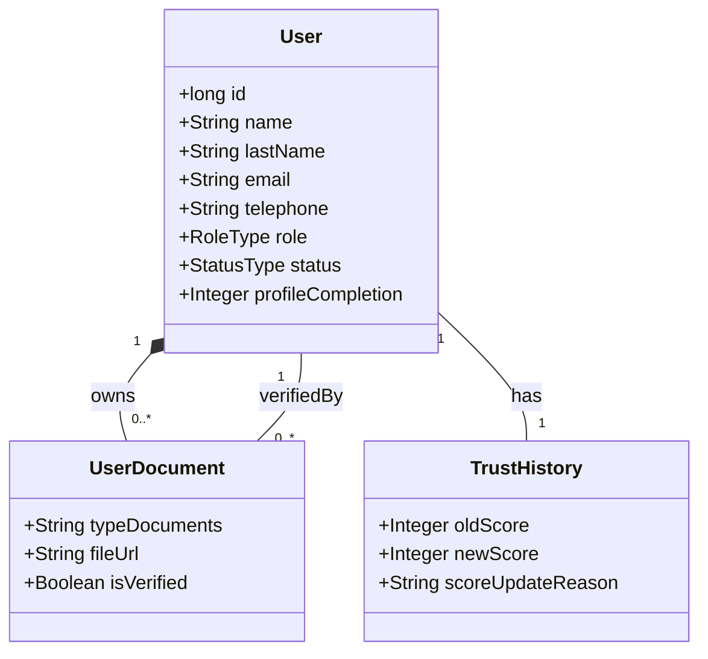
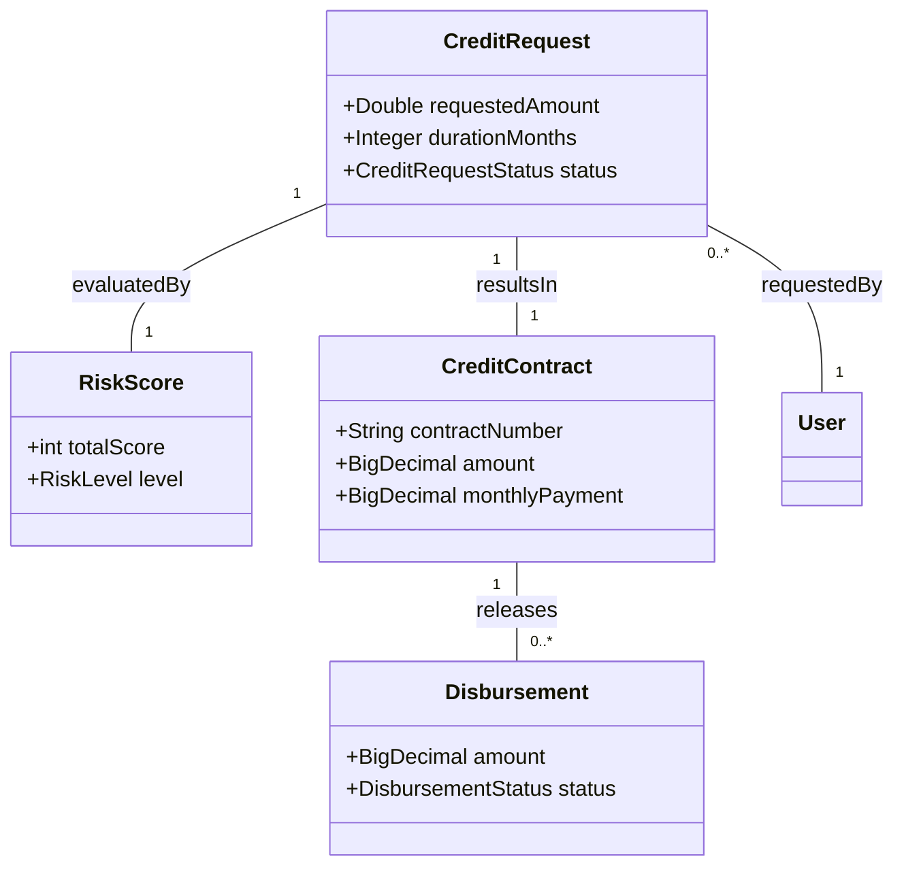
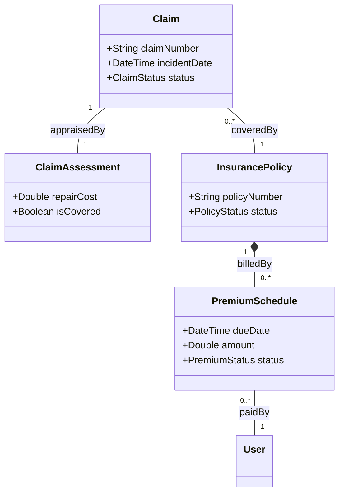
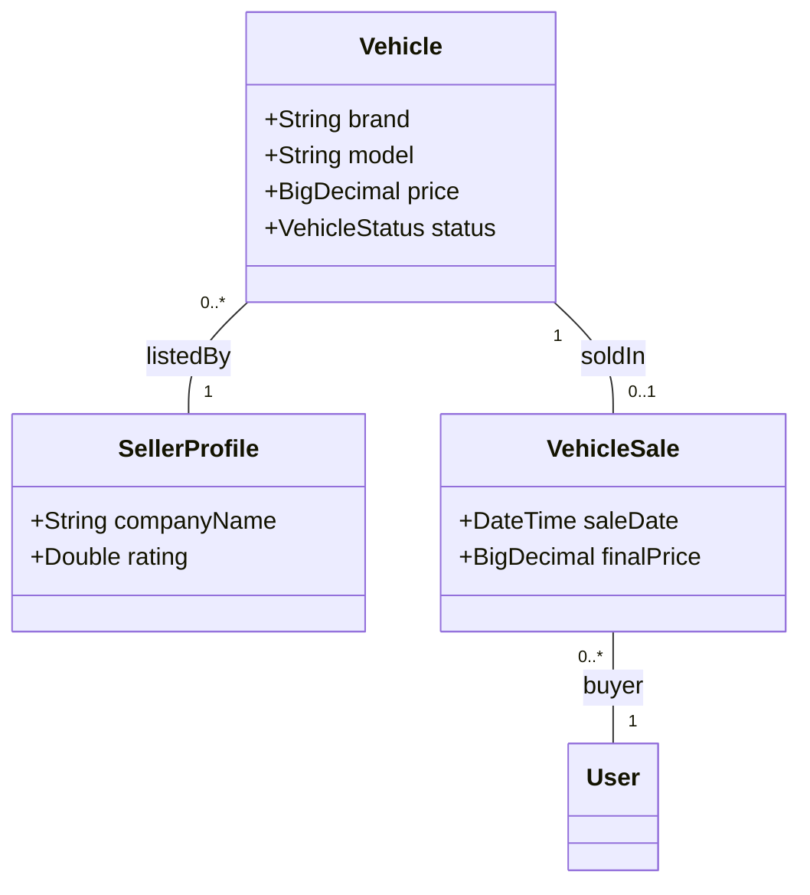
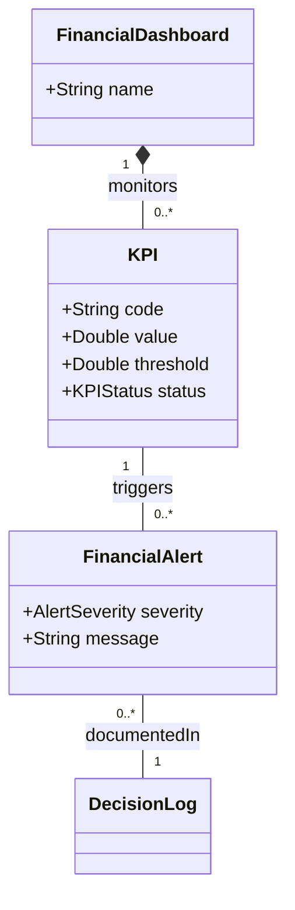
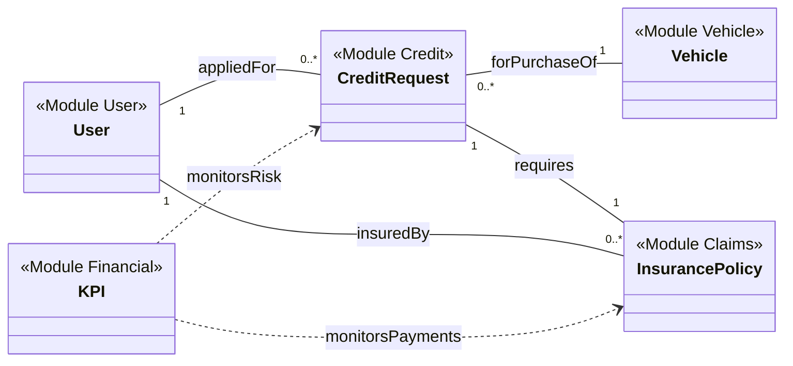

# 📊 **FIN'IX - DIAGRAMMES DE CLASSES**

Ce document présente l'architecture logicielle du projet **FIN'IX** sous forme de diagrammes de classes Mermaid, organisés par modules fonctionnels, suivis d'une vue globale.

---

## 👤 **1. MODULE : USER (IDENTITÉ & CONFIANCE)**
Gère les profils utilisateurs, le KYC et le score de confiance.

---

## 🏦 **2. MODULE : CRÉDIT (ACQUISITION)**
Gestion des demandes, du risque et des contrats de prêt.

---

## 🛡️ **3. MODULE : CLAIMS & PRIMES (PROTECTION)**
Gestion des sinistres et recouvrement des mensualités d'assurance.

---

## 🚗 **4. MODULE : VEHICLE (CATALOGUE & VENTE)**
Gestion du parc automobile et des transactions de vente.

---

## 🔐📈 **5. MODULE : SECURITY & FINANCIAL (INTELLIGENCE)**
Pilotage stratégique et conformité.

---

## 🌍 **VUE GLOBALE DU SYSTÈME**
Interconnexion des grands piliers de FIN'IX.

