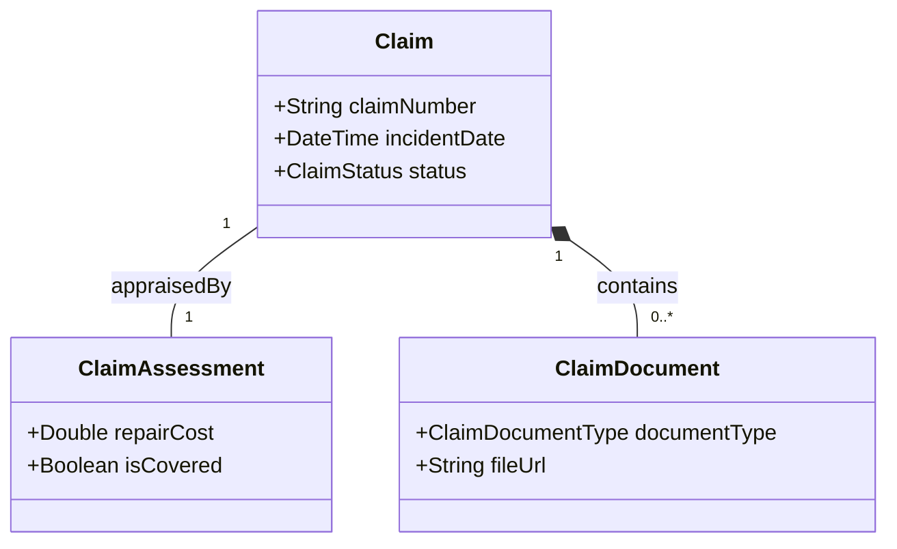

# 🛡️ Module Claims
Gestion des sinistres et expertises.

## Class Diagram

```mermaid
classDiagram
    class Claim {
        +String claimNumber
        +DateTime incidentDate
        +ClaimStatus status
    }
    class ClaimAssessment {
        +Double repairCost
        +Boolean isCovered
    }
    class ClaimDocument {
        +ClaimDocumentType documentType
        +String fileUrl
    }
    Claim "1" -- "1" ClaimAssessment : appraisedBy
    Claim "1" *-- "0..*" ClaimDocument : contains
```
