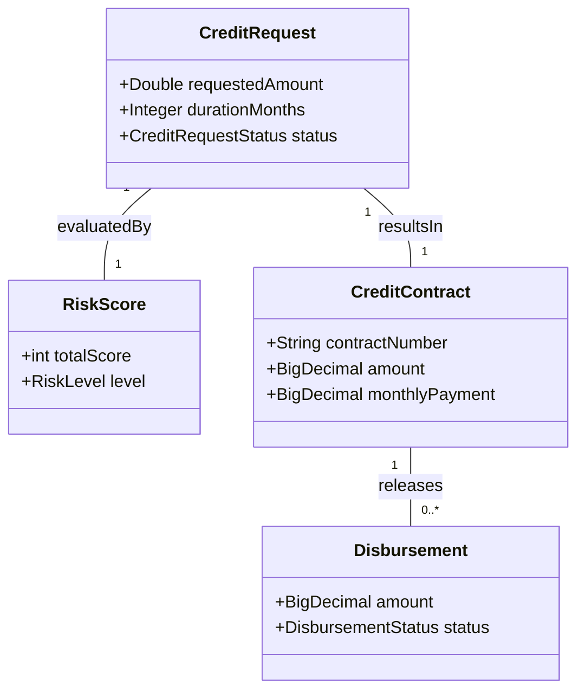

# 🏦 Module Credit
Gestion des demandes, du risque et des contrats de prêt.

## Class Diagram

```mermaid
classDiagram
    class CreditRequest {
        +Double requestedAmount
        +Integer durationMonths
        +CreditRequestStatus status
    }
    class RiskScore {
        +int totalScore
        +RiskLevel level
    }
    class CreditContract {
        +String contractNumber
        +BigDecimal amount
        +BigDecimal monthlyPayment
    }
    class Disbursement {
        +BigDecimal amount
        +DisbursementStatus status
    }
    CreditRequest "1" -- "1" RiskScore : evaluatedBy
    CreditRequest "1" -- "1" CreditContract : resultsIn
    CreditContract "1" -- "0..*" Disbursement : releases
```
