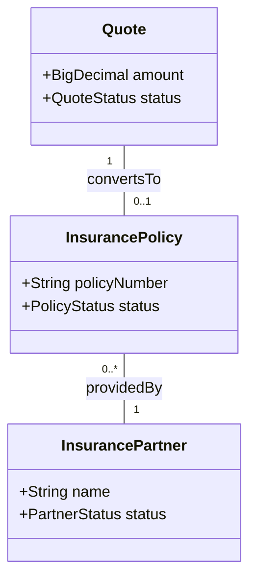

# 📄 Module Insurance
Gestion de la souscription et des polices.

## Class Diagram

```mermaid
classDiagram
    class InsurancePolicy {
        +String policyNumber
        +PolicyStatus status
    }
    class InsurancePartner {
        +String name
        +PartnerStatus status
    }
    class Quote {
        +BigDecimal amount
        +QuoteStatus status
    }
    InsurancePolicy "0..*" -- "1" InsurancePartner : providedBy
    Quote "1" -- "0..1" InsurancePolicy : convertsTo
```
