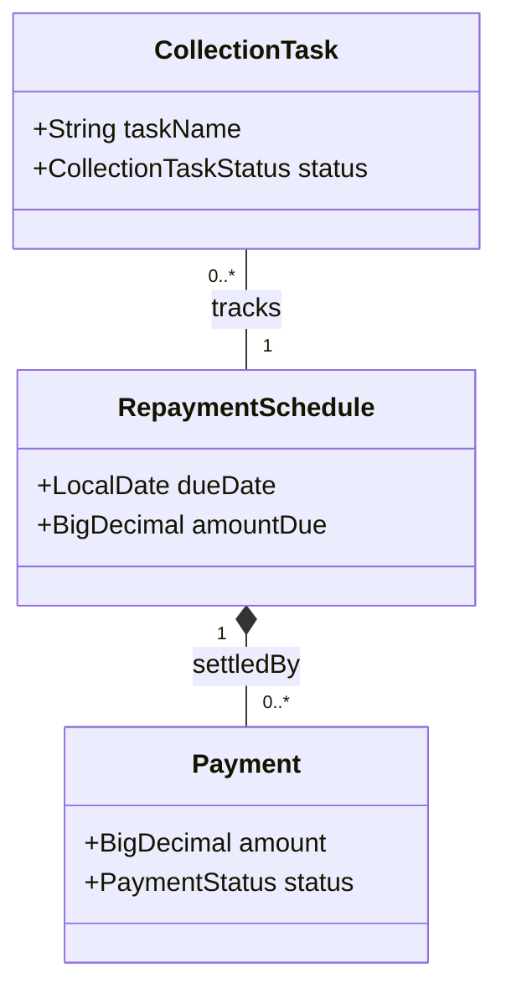

# 💸 Module Repayment
Gestion des remboursements et du recouvrement.

## Class Diagram

```mermaid
classDiagram
    class Payment {
        +BigDecimal amount
        +PaymentStatus status
    }
    class RepaymentSchedule {
        +LocalDate dueDate
        +BigDecimal amountDue
    }
    class CollectionTask {
        +String taskName
        +CollectionTaskStatus status
    }
    RepaymentSchedule "1" *-- "0..*" Payment : settledBy
    CollectionTask "0..*" -- "1" RepaymentSchedule : tracks
```
