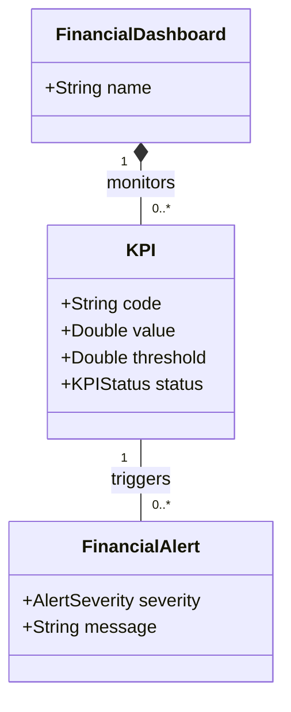

# 🔐📈 Module Security & Financial
Pilotage stratégique et alertes.

## Class Diagram

```mermaid
classDiagram
    class KPI {
        +String code
        +Double value
        +Double threshold
        +KPIStatus status
    }
    class FinancialDashboard {
        +String name
    }
    class FinancialAlert {
        +AlertSeverity severity
        +String message
    }
    FinancialDashboard "1" *-- "0..*" KPI : monitors
    KPI "1" -- "0..*" FinancialAlert : triggers
```
