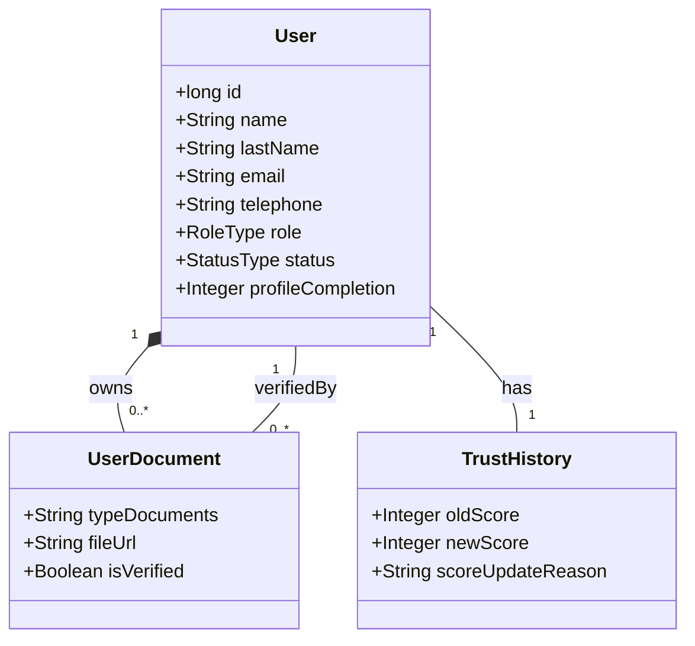

# 👤 Module User
Gère les profils utilisateurs, le KYC et le score de confiance.

## Class Diagram

```mermaid
classDiagram
    class User {
        +long id
        +String name
        +String lastName
        +String email
        +String telephone
        +RoleType role
        +StatusType status
        +Integer profileCompletion
    }
    class UserDocument {
        +String typeDocuments
        +String fileUrl
        +Boolean isVerified
    }
    class TrustHistory {
        +Integer oldScore
        +Integer newScore
        +String scoreUpdateReason
    }
    User "1" *-- "0..*" UserDocument : owns
    User "1" -- "1" TrustHistory : has
    UserDocument "0..*" -- "1" User : verifiedBy
```
