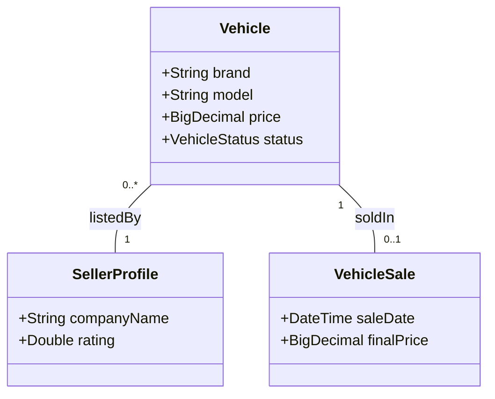

# 🚗 Module Vehicle
Gestion du catalogue automobile et des ventes.

## Class Diagram

```mermaid
classDiagram
    class Vehicle {
        +String brand
        +String model
        +BigDecimal price
        +VehicleStatus status
    }
    class SellerProfile {
        +String companyName
        +Double rating
    }
    class VehicleSale {
        +DateTime saleDate
        +BigDecimal finalPrice
    }
    Vehicle "0..*" -- "1" SellerProfile : listedBy
    Vehicle "1" -- "0..1" VehicleSale : soldIn
```
